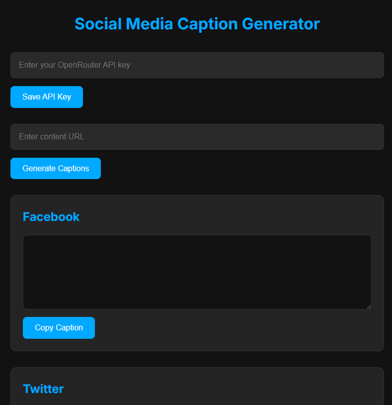

# Social Media Caption Generator

A modern, responsive web application that generates platform-specific captions for Facebook, Twitter, Pinterest, and Instagram using AI. The application uses OpenRouter AI to create engaging captions tailored to each social media platform's requirements and best practices.

## 🌟 Features

- **Platform-Specific Captions**: Generates optimized captions for:
  - Facebook
  - Twitter
  - Pinterest
  - Instagram
- **AI-Powered**: Uses OpenRouter AI for intelligent caption generation
- **Progress Indicators**: Visual feedback during generation
- **Responsive Design**: Works on desktop and mobile devices
- **Dark Theme**: Easy on the eyes
- **Copy to Clipboard**: One-click copying of generated captions

## 🚀 Live Demo

Visit the live application: [Social Media Caption Generator](https://xhanafix.github.io/caption-generator/)

## 🔑 OpenRouter API Setup

1. Visit [OpenRouter](https://openrouter.ai/) and create an account
2. Generate an API key from your dashboard
3. The application uses the following OpenRouter API endpoint:
